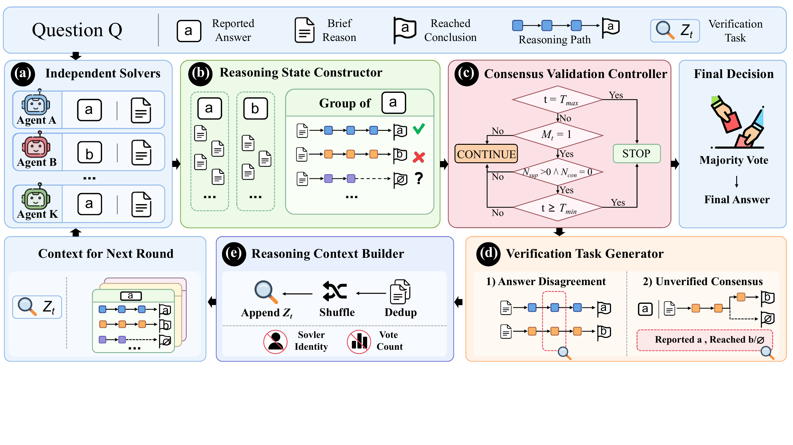

# SG-MAD: State-Guided Multi-Agent Debate with Explicit Reasoning Support

This repository accompanies the paper **SG-MAD: State-Guided Multi-Agent Debate with Explicit Reasoning Support**.

SG-MAD constructs an explicit reasoning state by separately representing reported answers, reasoning paths, and the conclusions reached by those paths. The resulting state guides consensus validation, targeted verification, and structured context construction.



> **Code Release:** The full implementation, prompts, experiment scripts, and configurations will be released upon acceptance.

## Overview

The repository is intentionally structured during the review period so that the paper-facing organization and release interface are stable before the implementation is published.

## Framework

The framework consists of five interacting stages:

1. Independent solvers produce a reported answer and a brief reason.
2. The Reasoning State Constructor groups responses and records explicit reasoning paths.
3. The Consensus Validation Controller decides whether the current state supports stopping.
4. The Verification Task Generator selects a targeted check when another round is needed.
5. The Reasoning Context Builder anonymizes and structures the evidence for the next round.

## Main Results

The paper-facing summaries are available in [`results/`](results/):

- [`main_results.csv`](results/main_results.csv) — main comparison;
- [`ablation_results.csv`](results/ablation_results.csv) — component ablations;
- [`sensitivity_summary.csv`](results/sensitivity_summary.csv) — solver-count and round-budget sensitivity.

The headline comparison is summarized below.

| Method | Macro-average accuracy |
|---|---:|
| CoT | 69.66 |
| SC@3 | 69.85 |
| Vanilla MAD | 75.41 |
| ConsensusMAD | 70.60 |
| **SG-MAD** | **78.98** |

## Repository Structure

```text
SG-MAD/
├── README.md
├── LICENSE
├── requirements.txt
├── .gitignore
├── assets/
│   └── framework.png
├── prompts/
│   └── README.md
├── experiments/
│   ├── comparison/
│   │   └── README.md
│   ├── ablation/
│   │   └── README.md
│   └── sensitivity/
│       └── README.md
└── results/
    ├── README.md
    └── paper-facing result summaries
```

The paper-to-repository mapping is:

```text
Main Results        → experiments/comparison/
Ablation Study      → experiments/ablation/
Parameter Influence → experiments/sensitivity/
```

## Reproduce the Experiments

> **Note:** The implementation is currently withheld during the review process and will be released upon acceptance. The commands below document the reproducibility interface that will be provided with the full release; they are not executable in the review-period repository.

### Main Comparison

```bash
bash experiments/comparison/run.sh
```

### Ablation Study

```bash
bash experiments/ablation/run.sh
```

### Sensitivity Analysis

```bash
bash experiments/sensitivity/run.sh
```

## Citation

For the paper, use the following review-period wording:

```latex
Code will be released at \url{https://github.com/cqxiang-repo/SG-MAD}.
```

The citation entry will be updated with the final publication metadata after acceptance.

## License

The repository is released under the MIT License. See [`LICENSE`](LICENSE).
